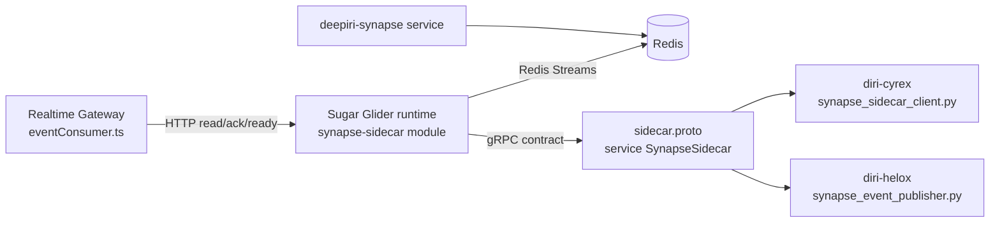

# Sugar Glider / Synapse Repo Decision

Last updated: 2026-04-08
Owner: Platform Engineering (workstream lead: Kyle Barnette)

## Goal
Answer the architecture decision requested by leadership:
1. Should `deepiri-sugar-glider` be its own repo?
2. Should `deepiri-synapse` be its own repo/package?
3. Where should Sugar Glider live relative to Synapse?

This document is the running implementation artifact for tasks `A1-A8`.

## Task Status
- [x] `A1` Capture current-state architecture
- [x] `A2` Inventory compatibility anchors
- [x] `A3` Define the decision rubric
- [x] `A4` Evaluate Option 1 (stay in `deepiri-platform`)
- [x] `A5` Evaluate Option 2 (extract Sugar Glider only)
- [x] `A6` Evaluate Option 3 (extract Sugar Glider + Synapse contract)
- [x] `A7` Choose recommendation and migration order
- [x] `A8` Publish decision package (memo + boss summary)

## A1 Output: Current-State Architecture

### 1) Runtime placement today
- Sugar Glider runtime is implemented inside:
  - `platform-services/shared/deepiri-sugar-glider`
- Realtime Gateway consumes Sugar Glider over HTTP endpoints (`/readyz`, `/v1/read`, `/v1/ack`) via:
  - `platform-services/backend/deepiri-realtime-gateway/src/streaming/eventConsumer.ts`
- RTG environment supports both naming surfaces:
  - Preferred: `SYNAPSE_SUGAR_GLIDER_URL`
  - Compatibility fallback: `SYNAPSE_SIDECAR_URL`

### 2) Local deployment topology
- Local compose stack for this lane:
  - `docker-compose.rtg-sugar-glider.local.yml`
- Service name is `synapse-sugar-glider`, with `synapse-sidecar` kept as network alias for compatibility.
- Healthcheck still uses the legacy binary entrypoint:
  - `/app/sidecar healthcheck`

### 3) Consumer integrations
- **Cyrex** currently consumes the gRPC contract using sidecar-named generated stubs:
  - `diri-cyrex/app/integrations/streaming/synapse_sidecar_client.py`
  - imports `proto.synapse.v1.sidecar_pb2` and `sidecar_pb2_grpc`
  - stub type `SynapseSidecarStub`
- **Helox** currently publishes events through sidecar-mode support:
  - `diri-helox/integrations/synapse_event_publisher.py`
  - transport mode: `SYNAPSE_TRANSPORT=sidecar`
  - default endpoint fallback: `http://synapse-sidecar:8081`
  - gRPC uses sidecar protobuf stubs

### 4) Contract ownership shape today
- Canonical contract file is still sidecar-named:
  - `platform-services/shared/deepiri-sugar-glider/proto/synapse/v1/sidecar.proto`
- Service name in the proto is:
  - `SynapseSidecar`
- Generated client artifacts are committed under both:
  - `diri-cyrex/app/integrations/streaming/gen/...`
  - `diri-helox/integrations/streaming/gen/...`

### 5) Repo topology relevant to this decision
- `deepiri-platform` tracks multiple component repos as gitlinks/submodules.
- Current gitlinks include:
  - `diri-cyrex`, `diri-helox`, `deepiri-modelkit`, `deepiri-core-api`, and multiple backend/shared services.
- `.gitmodules` does not currently list every gitlink path, which indicates mixed historical submodule management and increases change-management risk for extraction work.

### 6) Current-state dependency map

## A1 Conclusions
- Sugar Glider is operationally embedded in RTG today, not yet separated as an independently owned runtime repo.
- The contract and consumer ecosystem are still sidecar-named at the protobuf and generated-client layers.
- Any repo extraction decision must account for cross-repo client regeneration and compatibility sequencing (Cyrex + Helox), not only RTG code movement.

## A2 Output: Compatibility Anchor Inventory

### 1) Proto + contract anchors (intentionally still sidecar-named)
- Canonical proto path remains:
  - `platform-services/shared/deepiri-sugar-glider/proto/synapse/v1/sidecar.proto`
- Service name in proto remains:
  - `SynapseSidecar`
- Generated Python modules remain sidecar-named:
  - `sidecar_pb2.py`
  - `sidecar_pb2_grpc.py`

Migration sensitivity:
- Renaming proto package/service/module names in this phase would require synchronized regeneration and rollout across RTG, Cyrex, and Helox.
- Keeping proto/stub names stable during architecture decision work reduces blast radius.

### 2) Consumer/client naming anchors (Cyrex + Helox)
- Cyrex integration uses sidecar client naming:
  - `diri-cyrex/app/integrations/streaming/synapse_sidecar_client.py`
  - `SynapseSidecarStub` and `sidecar_pb2*` imports.
- Helox integration uses sidecar transport + stubs:
  - `diri-helox/integrations/synapse_event_publisher.py`
  - gRPC imports from sidecar-named generated modules.

Migration sensitivity:
- Consumer naming and generated imports are hard compatibility anchors.
- Any contract rename needs cross-repo PR coordination, release ordering, and rollback-safe dual-support.

### 3) Environment/config anchors
- RTG supports:
  - preferred `SYNAPSE_SUGAR_GLIDER_URL`
  - compatibility `SYNAPSE_SIDECAR_URL`
- Cyrex + Helox + scripts still rely on sidecar env/config surfaces:
  - `SYNAPSE_TRANSPORT=sidecar`
  - `SYNAPSE_SIDECAR_URL`
  - `SYNAPSE_SIDECAR_TIMEOUT_SEC`
  - `SYNAPSE_SIDECAR_SENDER`
  - `SYNAPSE_GRPC_ADDR`

Migration sensitivity:
- Env key migration must be staged; immediate hard rename risks local/dev breakage and silent misconfiguration.
- Dual-key or adapter-period support is required until all consumers are aligned.

### 4) Service alias + ops anchor points
- Compose and operational scripts still keep sidecar aliasing:
  - `docker-compose.rtg-sugar-glider.local.yml` includes `synapse-sidecar` alias.
  - `scripts/dev/sugarglider/preflight.sh` and `scripts/dev/sugarglider/stack_watchdog.sh` recognize sidecar naming.
- Make targets preserve sidecar command surfaces:
  - `rtg-sidecar-*` targets in `Makefile`.

Migration sensitivity:
- Ops/tooling assumptions are distributed and script-bound.
- Alias removal must wait for a coordinated scripts/docs update wave.

### 5) Binary/runtime anchors
- Sugar Glider container still builds/executes sidecar binary name:
  - `platform-services/shared/deepiri-sugar-glider/Dockerfile`
  - `/out/sidecar`, `/app/sidecar`, healthcheck/entrypoint use `sidecar`.

Migration sensitivity:
- Binary rename is low business value right now and creates avoidable deployment/test churn.
- Keep binary compatibility until architecture path is finalized.

### 6) WAL compatibility anchor
- WAL implementation intentionally supports legacy and canonical filenames:
  - `platform-services/shared/deepiri-sugar-glider/internal/wal/wal.go`
  - canonical `sugar-glider.wal.jsonl`
  - legacy fallback `sidecar.wal.jsonl`

Migration sensitivity:
- Legacy WAL fallback is required for continuity and rollback safety.
- Removing fallback before migration completion risks local state loss and replay issues.

### 7) Runtime consumer identity anchor
- RTG consumer transport naming intentionally remains sidecar-aligned:
  - `platform-services/backend/deepiri-realtime-gateway/src/streaming/eventConsumer.ts`
  - consumer name/suffix compatibility remains tied to `sidecar`.

Migration sensitivity:
- Consumer naming affects stream group/offset semantics and operational observability.
- Name changes require explicit migration strategy for stream/consumer continuity.

## A2 Conclusions
- Sidecar naming persists by design at contract, env, ops, and runtime identity layers.
- These anchors are compatibility-critical; they should remain stable during architecture decision work (`A3-A8`).
- Architecture recommendation should treat naming cleanup as a later, explicit migration lane with dual-support and rollback gates.

## A3 Output: Decision Rubric

### 1) Scoring scale and evaluation method
- Score each criterion on a `1-5` scale:
  - `1` = poor fit / high risk
  - `3` = acceptable with mitigations
  - `5` = strong fit / low risk
- Weighted total per option:
  - `weighted_score = sum(score * weight)`
- Maximum possible total:
  - `5.00` (weights sum to `1.00`)

### 2) Criteria and weights (locked for A4-A6)

| Criterion | Weight | What we measure |
|---|---:|---|
| Ownership clarity | 0.15 | Single-team accountability, boundary clarity, and operational ownership. |
| Release cadence fit | 0.10 | Ability for Sugar Glider/Synapse changes to ship at the right pace without blocking unrelated services. |
| Versioning model quality | 0.10 | Clarity and enforceability of contract/runtime versioning across repos. |
| CI/CD complexity | 0.15 | Pipeline count, integration complexity, QA burden, and failure surface. |
| Local developer cost | 0.10 | Setup friction, mock/dependency burden, and inner-loop speed for contributors. |
| Cross-repo coordination overhead | 0.10 | Number of synchronized PRs/releases needed for normal feature work. |
| Migration risk | 0.20 | Likelihood and impact of regressions while moving to the target structure. |
| Rollback safety | 0.10 | Ability to revert quickly and safely under production or QA failure. |

Weighting rationale:
- Migration and execution safety are intentionally weighted highest (`migration risk` + `rollback safety` + `CI/CD complexity` = `0.45`) because this lane has active compatibility anchors and multi-repo consumers.
- Ownership and release needs are second-priority (`0.25`) so architecture remains operationally sustainable after cutover.
- Developer and coordination costs remain material (`0.20`) but should not override safety.

### 3) Mandatory gates (must pass regardless of score)
- **Compatibility gate:** Option must preserve A2 anchors during migration or provide explicit dual-support sequence.
- **No-main-direct gate:** Implementation remains branch/PR based (`feature -> dev`), with no direct `main` edits.
- **Consumer continuity gate:** Cyrex and Helox must retain working contract integration through each migration phase.
- **Rollback gate:** Each migration phase must define exact rollback action and data safety posture (including WAL continuity).

### 4) Tie-break rules
- If weighted totals are within `0.25`, choose the option with lower `migration risk`.
- If still tied, choose the option with higher `rollback safety`.
- If still tied, prefer lower `cross-repo coordination overhead` for next-quarter execution speed.

### 5) Output format to use in A4-A6
For each option we will publish:
- criterion-by-criterion score table (`1-5` + weighted subtotal),
- explicit risks and mitigations,
- ownership model,
- required migration sequence and rollback steps.

## A3 Conclusions
- The rubric is now fixed and objective enough to compare all three architecture options consistently.
- Safety constraints from A2 are elevated into mandatory gates, so high-level preference cannot override compatibility/rollback requirements.
- `A4-A6` can now proceed without inventing new evaluation criteria midstream.

## A4 Output: Option 1 Evaluation (Keep Sugar Glider in `deepiri-platform`)

### Option 1 definition
- Keep Sugar Glider implementation where it is today:
  - `platform-services/shared/deepiri-sugar-glider`
- Keep Synapse contract ownership in current location for now (no repo extraction in this phase).
- Continue compatibility-first naming posture from A2.

### Scorecard (rubric from A3)

| Criterion | Weight | Score (1-5) | Weighted |
|---|---:|---:|---:|
| Ownership clarity | 0.15 | 2 | 0.30 |
| Release cadence fit | 0.10 | 2 | 0.20 |
| Versioning model quality | 0.10 | 2 | 0.20 |
| CI/CD complexity | 0.15 | 4 | 0.60 |
| Local developer cost | 0.10 | 3 | 0.30 |
| Cross-repo coordination overhead | 0.10 | 3 | 0.30 |
| Migration risk | 0.20 | 5 | 1.00 |
| Rollback safety | 0.10 | 5 | 0.50 |
| **Total** | **1.00** |  | **3.40 / 5.00** |

### Why these scores
- `Ownership clarity (2)`: runtime + contract + consumers are still coupled across RTG/Cyrex/Helox without hard boundary ownership.
- `Release cadence fit (2)`: Sugar Glider changes remain tied to broader platform release rhythm.
- `Versioning model quality (2)`: contract is shared, but version governance is implicit rather than package-version enforced.
- `CI/CD complexity (4)`: avoids introducing new pipeline surfaces during current lane; current pipeline count stays stable.
- `Local developer cost (3)`: no new repo bootstrapping, but existing multi-component setup remains non-trivial.
- `Cross-repo coordination (3)`: moderate; extraction coordination is avoided, but consumer updates still require multi-repo PR work when contracts change.
- `Migration risk (5)`: lowest immediate risk because no structural extraction occurs.
- `Rollback safety (5)`: rollback remains straightforward to existing known topology and compatibility anchors.

### Mandatory gate check
- Compatibility gate: **PASS**
  - A2 anchors remain intact; no forced rename/migration required.
- No-main-direct gate: **PASS**
  - Can be executed entirely through feature branch PRs to `dev`.
- Consumer continuity gate: **PASS**
  - Cyrex/Helox integration stays on current contract surface.
- Rollback gate: **PASS**
  - Structural rollback is trivial because structure is unchanged.

### Pros
- Lowest short-term delivery risk and fastest path to stable `dev` integration.
- Preserves current compatibility anchors without extra migration mechanics.
- Minimizes CI/CD and release-process churn during active feature work.

### Cons
- Boundaries stay blurry; long-term ownership and accountability remain ambiguous.
- Contract/version governance stays ad hoc rather than explicit package/repo semantics.
- Harder to optimize independent release velocity for Sugar Glider.

### Risks and mitigations
- Risk: architectural debt grows as more consumers bind to sidecar-era surfaces.
  - Mitigation: enforce explicit compatibility policy and deprecation calendar in follow-on work.
- Risk: future extraction becomes larger/more expensive.
  - Mitigation: begin extraction pre-work now (contract packaging rules, client generation process, ownership docs) even if extraction is deferred.
- Risk: mixed naming (`sidecar` and `sugar-glider`) continues to confuse contributors.
  - Mitigation: maintain one authoritative mapping table and migration checklist in docs.

### Ownership model under Option 1
- Platform/RTG team:
  - Sugar Glider runtime code, HTTP behavior, WAL behavior, compose + local ops.
- Contract stewardship (current location):
  - `sidecar.proto` evolution policy, compatibility guarantees, and regen guidance.
- Consumer teams (Cyrex/Helox):
  - Integration adapters and generated client refresh when contract updates are approved.

## A4 Conclusions
- Option 1 is the safest immediate execution path, with strong migration/rollback safety.
- Its tradeoff is strategic: it defers boundary cleanup and keeps ownership/versioning less explicit.
- This becomes a baseline comparator for A5/A6, not yet the final recommendation.

## A5 Output: Option 2 Evaluation (Extract `deepiri-sugar-glider` Only)

### Option 2 definition
- Extract Sugar Glider runtime into its own repo (`deepiri-sugar-glider`).
- Keep Synapse contract ownership where it currently lives for now (no Synapse contract repo/package extraction in this phase).
- Keep compatibility anchors from A2 during and after extraction.

### Proposed extraction scope (runtime only)
- Move from current location:
  - `platform-services/shared/deepiri-sugar-glider`
- New repo owns:
  - runtime service code (`internal/*`, server boot, health/read/ack behavior),
  - Dockerfile/build scripts, runtime tests, runtime README/ops docs.
- Contract source remains where it is for this option:
  - protobuf source-of-truth and compatibility policy are not moved yet.

### Dependency impact
- `deepiri-platform` gains an external dependency on `deepiri-sugar-glider` (gitlink/submodule or image/artifact pinning strategy).
- Compose and scripts in platform must reference extracted runtime source/image while preserving:
  - `synapse-sugar-glider` service identity and `synapse-sidecar` compatibility alias.
- Cyrex and Helox contract clients remain unchanged in this option; they continue consuming sidecar-named stubs.

### Release/versioning impact
- Sugar Glider runtime can release independently from platform code once extraction lands.
- Contract versioning remains partially coupled because proto stewardship is still centralized outside the runtime repo.
- Net effect: runtime cadence improves, but full contract/runtime decoupling is incomplete.

### Scorecard (rubric from A3)

| Criterion | Weight | Score (1-5) | Weighted |
|---|---:|---:|---:|
| Ownership clarity | 0.15 | 4 | 0.60 |
| Release cadence fit | 0.10 | 4 | 0.40 |
| Versioning model quality | 0.10 | 3 | 0.30 |
| CI/CD complexity | 0.15 | 3 | 0.45 |
| Local developer cost | 0.10 | 2 | 0.20 |
| Cross-repo coordination overhead | 0.10 | 2 | 0.20 |
| Migration risk | 0.20 | 3 | 0.60 |
| Rollback safety | 0.10 | 3 | 0.30 |
| **Total** | **1.00** |  | **3.05 / 5.00** |

### Why these scores
- `Ownership clarity (4)`: runtime responsibility becomes explicit in its own repo.
- `Release cadence fit (4)`: runtime hotfixes/features can ship without waiting on broader platform bundles.
- `Versioning model quality (3)`: improved for runtime; still partial because contract ownership remains external.
- `CI/CD complexity (3)`: new pipelines and release wiring are required, but still simpler than extracting both runtime and contract.
- `Local developer cost (2)`: local iteration now needs coordinated multi-repo setup/pinning.
- `Cross-repo coordination (2)`: runtime-contract-consumer flows require more synchronized PR/release choreography.
- `Migration risk (3)`: moderate due to extraction and wiring changes across compose/scripts/import paths.
- `Rollback safety (3)`: rollback is feasible but requires repo-reference/image pin rollback, not just in-place revert.

### Mandatory gate check
- Compatibility gate: **PASS (with controls)**
  - Requires strict preservation of sidecar compatibility anchors during extraction.
- No-main-direct gate: **PASS**
  - Can be delivered through feature branches and PRs into `dev`.
- Consumer continuity gate: **PASS (with controls)**
  - Must avoid proto/service-name churn while extraction is underway.
- Rollback gate: **PASS (with controls)**
  - Must define pinned fallback image/ref and one-command compose rollback path.

### Pros
- Clarifies runtime ownership and enables faster Sugar Glider release cadence.
- Creates clean runway for eventual full contract separation if desired.
- Keeps current consumers stable by deferring contract rename/extraction.

### Cons
- Introduces coordination overhead immediately (repo refs, version pins, release order).
- Leaves contract governance split across boundaries (partial decoupling).
- Adds local-dev and CI/CD operational complexity compared to Option 1.

### Risks and mitigations
- Risk: repo extraction breaks local compose/scripts.
  - Mitigation: keep alias compatibility and run preflight/watchdog/smoke gates on every extraction PR.
- Risk: runtime and contract drift over time.
  - Mitigation: establish contract compatibility check in CI before release promotion.
- Risk: rollback friction under incident pressure.
  - Mitigation: require tested fallback pin and rollback runbook before cutover.

### Ownership model under Option 2
- Sugar Glider repo team:
  - Runtime service code, runtime CI/CD, release tagging, runtime observability.
- Contract stewardship (current location):
  - Proto lifecycle, compatibility/deprecation policy, client regeneration guidance.
- Platform integration team:
  - Compose wiring, dependency pinning strategy, integration test gates in `deepiri-platform`.

## A5 Conclusions
- Option 2 improves ownership and release agility but introduces medium migration/coordination cost.
- This option is a strong middle path if leadership wants gradual decoupling without immediate contract extraction.
- Final recommendation depends on whether the org values near-term safety (Option 1) or boundary clarity/agility (Option 2/3).

## A6 Output: Option 3 Evaluation (Extract Sugar Glider + Synapse Contract)

### Option 3 definition
- Extract Sugar Glider runtime into `deepiri-sugar-glider`.
- Extract Synapse contract/proto ownership into `deepiri-synapse` (or equivalent dedicated contract package surface).
- Move to explicit package-version contract governance across producers/consumers.

### Repo boundaries under Option 3
- `deepiri-sugar-glider`:
  - runtime service behavior, WAL handling, health/read/ack APIs, runtime CI/CD.
- `deepiri-synapse` (contract repo/package):
  - proto source-of-truth, generation config, version tags, compatibility/deprecation policy.
- `deepiri-platform`:
  - integration/orchestration, compose wiring, dependency pinning, integration tests.
- `diri-cyrex` + `diri-helox`:
  - consume versioned Synapse client artifacts, not ad hoc copied/generated stubs.

### Versioning model under Option 3
- Contract package versioning:
  - semantic versioning with explicit backward-compatibility rules.
- Runtime versioning:
  - independent `deepiri-sugar-glider` release tags.
- Consumer pinning:
  - Cyrex/Helox pin contract versions and update intentionally via controlled PR waves.
- Promotion rule:
  - runtime releases that require contract changes must reference minimum compatible contract version.

### Migration cost profile
- Highest of all options due to:
  - extracting two repos instead of one,
  - introducing package/version lifecycle governance,
  - coordinated updates across RTG, platform wiring, Cyrex, and Helox,
  - temporary dual-support for A2 anchors during transition.
- Requires phased rollout and strict change windows to avoid contract/runtime skew.

### Failure modes and mitigations
- Failure mode: contract/runtime version mismatch across repos.
  - Mitigation: CI compatibility matrix (runtime version x contract version) as a merge gate.
- Failure mode: consumers pull incompatible contract version.
  - Mitigation: pinned dependency ranges + staged update PRs + canary integration tests.
- Failure mode: rollback complexity when both runtime and contract changed.
  - Mitigation: two-dimensional rollback runbook (runtime tag rollback + contract package rollback).
- Failure mode: migration stalls due to coordination overhead.
  - Mitigation: enforce phase ownership and milestone-based cutovers with explicit go/no-go criteria.

### Scorecard (rubric from A3)

| Criterion | Weight | Score (1-5) | Weighted |
|---|---:|---:|---:|
| Ownership clarity | 0.15 | 5 | 0.75 |
| Release cadence fit | 0.10 | 5 | 0.50 |
| Versioning model quality | 0.10 | 5 | 0.50 |
| CI/CD complexity | 0.15 | 2 | 0.30 |
| Local developer cost | 0.10 | 2 | 0.20 |
| Cross-repo coordination overhead | 0.10 | 1 | 0.10 |
| Migration risk | 0.20 | 2 | 0.40 |
| Rollback safety | 0.10 | 2 | 0.20 |
| **Total** | **1.00** |  | **2.95 / 5.00** |

### Why these scores
- `Ownership clarity (5)`: strongest clear boundaries across runtime, contract, and integration layers.
- `Release cadence fit (5)`: maximum release independence for runtime and contract evolution.
- `Versioning model quality (5)`: strongest explicit version semantics and dependency pinning discipline.
- `CI/CD complexity (2)`: multiple pipelines and compatibility checks increase build/release burden.
- `Local developer cost (2)`: local end-to-end work requires more repo bootstrap and version coordination.
- `Cross-repo coordination (1)`: highest ongoing coordination surface among options.
- `Migration risk (2)`: highest structural change scope and highest chance of multi-repo drift.
- `Rollback safety (2)`: rollback is possible but operationally hardest because two independently versioned assets can fail independently.

### Mandatory gate check
- Compatibility gate: **PASS (high control burden)**
  - Requires extended dual-support period for A2 anchors during phased migration.
- No-main-direct gate: **PASS**
  - Can be fully delivered via branch PR workflow to `dev`.
- Consumer continuity gate: **PASS (high control burden)**
  - Must sequence Cyrex/Helox upgrades against contract version tags.
- Rollback gate: **PASS (high control burden)**
  - Requires tested dual rollback strategy before cutover completion.

### Pros
- Best long-term architecture hygiene and ownership clarity.
- Strongest path to predictable contract governance and intentional compatibility policy.
- Highest potential for team autonomy and independent release velocity.

### Cons
- Largest delivery overhead in the near term.
- Most complex migration and operational change-management burden.
- Highest coordination tax for day-to-day cross-team work after extraction.

### Ownership model under Option 3
- Sugar Glider team:
  - Runtime implementation and runtime SLO ownership.
- Synapse contract team:
  - Proto lifecycle, compatibility policy, package releases, and SDK generation policy.
- Integration owners:
  - Platform compose/dependency integration plus consumer upgrade orchestration.

## A6 Conclusions
- Option 3 is the strongest strategic end-state for boundaries and version governance.
- It is also the most expensive/risky near-term path and needs disciplined phased execution to avoid disruption.
- This option should only be chosen now if leadership prioritizes long-term architecture over short-term delivery safety.

## A7 Output: Recommendation and Migration Order

### Final recommendation
- **Recommended path: Option 2 (extract `deepiri-sugar-glider` only), executed in phased rollout.**

Rationale:
- Option 1 scored highest for immediate safety, but it defers ownership clarity and keeps boundary ambiguity.
- Option 3 gives strongest long-term boundaries, but its migration/coordination risk is too high for current delivery pressure.
- Option 2 is the best balance: meaningful structural improvement now without full contract-repo extraction risk.

### Direct answers to leadership questions
1. Should Sugar Glider be its own repo?
   - **Yes, via phased extraction to `deepiri-sugar-glider`.**
2. Should Synapse be its own repo/package right now?
   - **Not in this phase.** Keep contract stewardship where it is, with explicit version policy first.
3. Where should Sugar Glider live relative to Synapse?
   - **Sugar Glider as independent runtime repo; Synapse remains the contract surface it depends on.**

### Phased migration sequence
1. **Phase 0: Decision lock + compatibility freeze (now)**
   - Lock A2 anchors as migration constraints.
   - Publish ownership and compatibility policy.
2. **Phase 1: Contract discipline in place (no extraction yet)**
   - Add explicit contract change policy and compatibility checks in current location.
   - Define client regeneration/update playbook for Cyrex/Helox.
3. **Phase 2: Create `deepiri-sugar-glider` repo and mirror runtime**
   - Move runtime code with no contract rename and no consumer-facing behavior change.
   - Stand up runtime CI/CD and release tagging.
4. **Phase 3: Integrate extracted runtime into `deepiri-platform`**
   - Update compose/dependency wiring to pinned runtime artifact/ref.
   - Preserve `synapse-sidecar` aliases and legacy env keys.
5. **Phase 4: Validate and promote**
   - Run preflight/watchdog/smoke + consumer integration checks.
   - Promote through `feature -> dev` workflow with QA gates.
6. **Phase 5: Stabilize and reassess Synapse extraction**
   - After stable runtime extraction, reassess Option 3 with fresh risk profile.

### What changes immediately vs what waits
- Changes immediately:
  - Adopt Option 2 as target architecture and begin Phase 1 readiness work.
  - Keep active implementation in `deepiri-platform` while extraction is prepared.
- Explicitly waits:
  - Synapse contract repo/package extraction.
  - Proto/service rename away from sidecar naming.
  - Removal of legacy env/service aliases and WAL fallback compatibility.

## A7 Conclusions
- The team should move toward independent Sugar Glider runtime ownership now, without forcing full contract extraction in the same window.
- This preserves delivery momentum while creating a clean runway for future contract decoupling.

## A8 Output: Decision Package and Communication Text

### Boss-facing summary (short)
- `A1-A6` architecture analysis is complete.
- Recommendation: extract `deepiri-sugar-glider` as its own repo in phases (Option 2), keep Synapse contract ownership where it is for now.
- This answers the 3 decision questions directly while minimizing near-term migration risk.
- We will preserve sidecar compatibility anchors during migration and only revisit Synapse repo extraction after Sugar Glider extraction stabilizes.

### Plaky comment (copy/paste)
Architecture decision update complete for Sugar Glider/Synapse (`A1-A8`):  
Recommendation is **Option 2** — extract `deepiri-sugar-glider` to its own repo in phased rollout, while keeping Synapse contract ownership in current location for now.  
Decision answers:
1) Sugar Glider own repo: **Yes (phased)**  
2) Synapse own repo/package now: **No (defer)**  
3) Sugar Glider relative to Synapse: **independent runtime repo consuming Synapse contract surface**  
Migration order is defined with compatibility/rollback gates and no direct `main` changes (`feature -> dev` workflow). Setting status to **Needs QA** for architecture review.

### GitHub PR summary text (copy/paste)
This PR delivers the Sugar Glider/Synapse architecture decision package (`A1-A8`) in `docs/architecture/SUGAR_GLIDER_SYNAPSE_REPO_DECISION.md`.

What is included:
- Current-state architecture and dependency map (`A1`)
- Compatibility-anchor inventory (`A2`)
- Weighted decision rubric (`A3`)
- Option evaluations for:
  - keep in platform (`A4`)
  - extract Sugar Glider only (`A5`)
  - extract Sugar Glider + Synapse contract (`A6`)
- Final recommendation + migration order (`A7`)
- Boss-facing communication text + Plaky/GitHub snippets (`A8`)

Recommendation:
- Proceed with **Option 2** phased extraction of `deepiri-sugar-glider`.
- Defer Synapse contract repo extraction until post-stabilization checkpoint.
